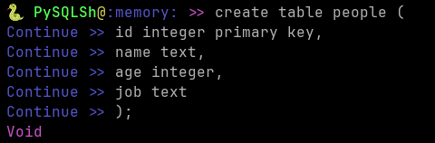
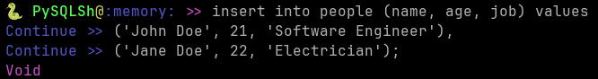
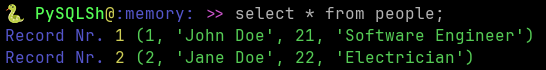
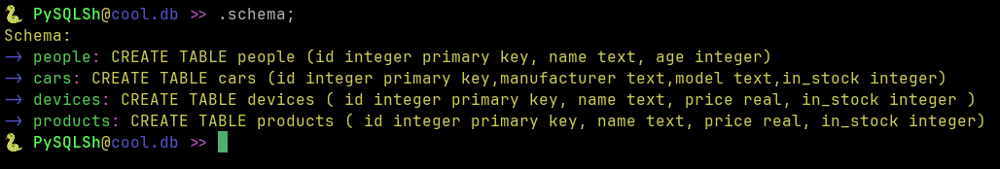
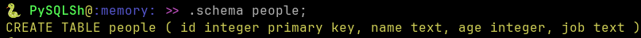
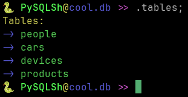

# PySQLSh
A shell for interacting with SQLite databases written in Python

## How do I use it?
### Cloning and launching
To clone this repository and launch the python script:

```bash
git clone https://github.com/Moritisimor/PySQLSh
cd PySQLSh
python pysqlsh.py
```

You should then be prompted to enter the path to a SQLite database. 

If you only want to look around, you can just type ```:memory:``` to use an in-memory database.

Instead of entering the path to the database each time, you can just pass it as a CLI argument like this:

```bash
python pysqlsh.py path/to/database
```

What's important to note is that PySQLSh uses ; to determine when input is done.

### Interacting with databases
You can simply execute SQL statements with this shell. 

For example, to create a table:



Insert some data:



And then query it:



### Builtins
PySQLSh also features a few builtins.

To see the schema of all tables:



To see the schema of a particular table:



To see all tables:



